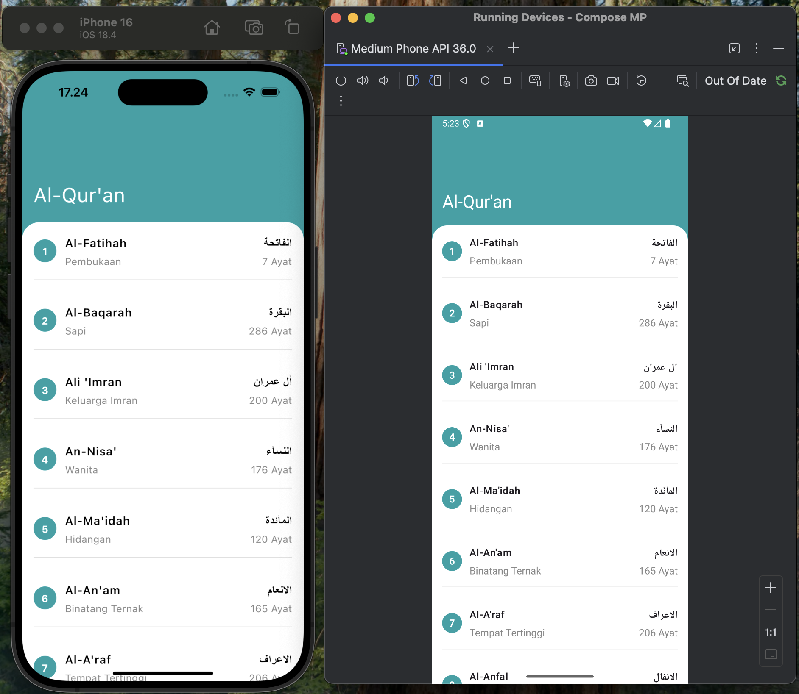
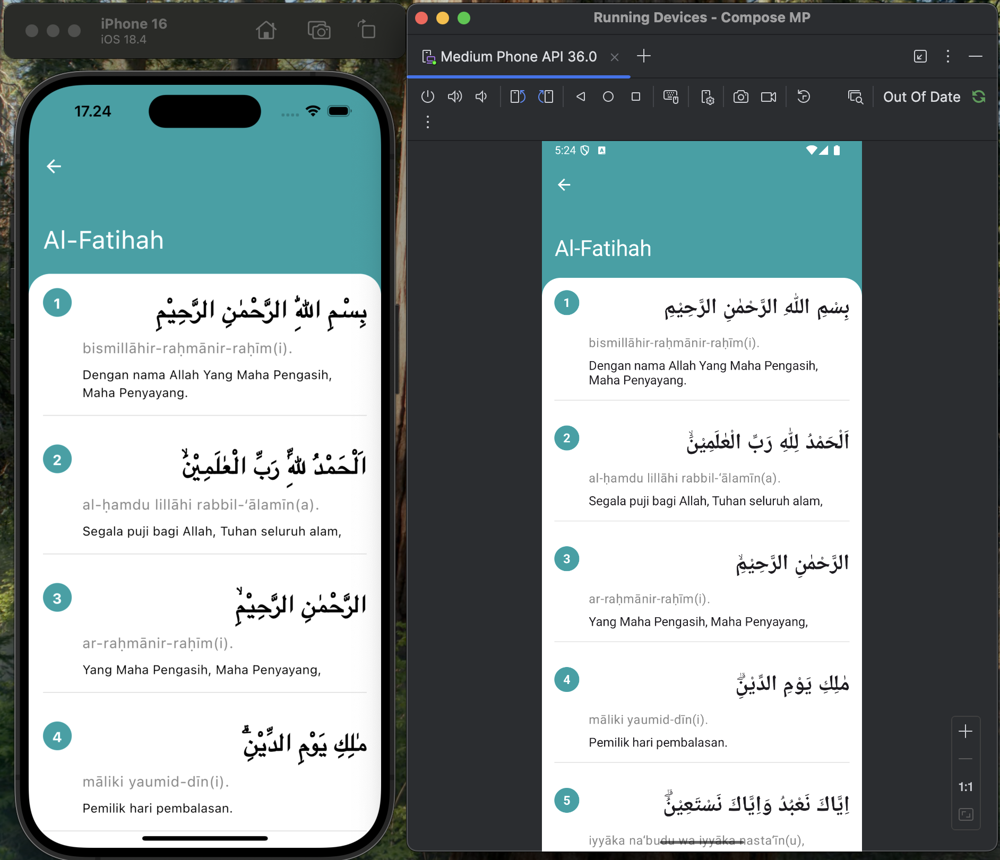

# 📖 Quran App (Kotlin Multiplatform + Compose Multiplatform)

A cross-platform Quran application built using **Kotlin Multiplatform (KMP)** with **Jetpack Compose Multiplatform (Android & iOS)**. This app displays the list of Surahs and their details using data from [equran.id](https://equran.id/).

## ✨ Features

- Quran Surah list with clean UI.
- Surah detail page with Arabic verses.
- Collapsing toolbar on Surah detail.
- Scrollable list using `LazyColumn`.
- Clean Architecture (MVI Pattern).
- Ktor for networking.
- Multiplatform support: Android & iOS.

## 🛠️ Tech Stack

- **Kotlin Multiplatform**
- **Jetpack Compose Multiplatform**
- **Ktor Client** (for API requests)
- **Material 3**
- **MVI Architecture**

## 🧱 Project Structure

```
├── androidApp/              # Android-specific code
├── iosApp/                  # iOS-specific code (using SwiftUI)
├── shared/                  # Shared KMP code
│   ├── data/                # Data layer (networking, DTO)
│   ├── domain/              # Domain models and use cases
│   ├── presentation/        # MVI ViewModel, UI state
│   ├── ui/                  # Compose UI components
│   └── App.kt               # Entry point for shared UI
└── build.gradle.kts         # Gradle build config
```

## 🚀 Getting Started

### 1. Prerequisites

- Android Studio **Hedgehog** or later
- Kotlin Multiplatform plugin
- Xcode (for iOS)
- JDK 17+

### 2. Clone the project

```bash
git clone https://github.com/haloekades/composemultiplatform.git
cd quran-kmp-app
```

### 3. Run on Android

Open `androidApp` in Android Studio and run on emulator or device.

### 4. Run on iOS

1. Open `iosApp/` in Xcode.
2. Set team signing.
3. Run on simulator or physical device.

> 💡 The iOS UI uses `UIKitViewController` wrapping Compose UI from shared module.

## 🧪 API Reference

All Surah data is fetched from:

- `GET https://equran.id/api/surat`
- `GET https://equran.id/api/surat/{id}`

## 📸 Screenshots

<p align="center">
  
</p>

<p align="center">
  
</p>

## 📄 License

MIT License © 2025

---

Made with ❤️ using KMP & Compose
